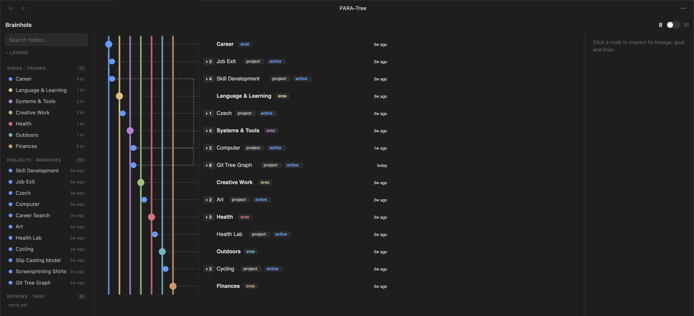

# PARA-Tree

A **git-graph-style view of your [PARA](https://fortelabs.com/blog/para/) vault second brain** for Obsidian. It reads the frontmatter/metadata you already have and draws your work the way a commit graph draws a repo — so you can see, at a glance, how scattered work ladders up to (or peels off from) your life-areas.



## Git, meet PARA, PARA meet Git

- **Areas = trunks** — long-lived vertical spines (one per `area:`), like `main`.
- **Projects = feature branches** — fork off their area, nest by `branched-from`, and merge back when `status` is done/ready.
- **Resources = commits** — notes filed under a project (`project:`) ride that branch; area-level resources sit on the trunk.
- **`contributes-to` = merges** — dashed cross-links (cross-area is fine) — the convergence a plain tree can't show.
- **Color** = identity for areas, **status** for work (active / in-progress / done / idea).
- **Last-edited** is visible per row across PARA types to track attention and progress.

It's read-only and live: edit a note's frontmatter and the graph updates.

## Features

- **Three panes** — a sidebar navigator (Areas / Projects / Reviews + search & legend), the graph, and an inspector (goal, next-action, last-edited, cadence, linked notes, open-note).
- **Packed ↔ Spread** lane toggle; **collapse/expand** subtrees (`▸N`); the **active area "breathes"** to a full spread while the rest stay compact.
- **Focus** on a node or area (click again to deselect); **search** jumps to any node.
- **Attention indicator** — set a `cadence:` and overdue projects get a small amber dot next to their last-edited time.
- Resizable panes; right-angle filleted connectors; desktop-first (mobile stacks).
- Note: this was designed for Desktop first - feedback on parity between Desktop and mobile appreciated.

## Frontmatter it reads

```yaml
type: project          # required for a project node (also: type: area, type: resource)
area: "[[Career]]"     # the trunk this project branches from
status: active         # active | in-progress | idea | done | ready-to-publish | archived
created: 2026-06-11    # used for row ordering
cadence: 14d           # optional review rhythm (14d / 2 weeks / weekly / monthly / 72h) → attention dot
goal: "…"              # shown in the inspector
next-action: "…"       # shown in the inspector
branched-from: "[[Job Exit]]"          # optional: branch off another project
contributes-to: ["[[Career Search]]"]  # optional: merge into another lane (cross-area ok)
promoted-to: "[[New Area]]"            # optional: project graduates into its own trunk
project: "[[Skill Development]]"       # on a resource note: the project it commits to
```

Notes in `_templates`, `04 Archive`, and `06 Reviews` are excluded. "Last edited" comes from the file's modified time — no field to maintain.

> **Note:** nodes are matched by note **name** (like Obsidian wikilinks), so give projects/resources **unique basenames** — two notes with the same filename will collide.

## Install

**Just getting started with Second Brains | PARA Note taking?** Setup a new Obsidian vault with this [template](https://github.com/Sparky-code/second-brain-starter-kit) that explains how this framework works and comes with PARA-Tree already installed.

**Beta via [BRAT](https://github.com/TfTHacker/obsidian42-brat)** (recommended while in beta): install BRAT, then *Add beta plugin* → `<your-github-username>/para-tree`.

**Manual:** copy `main.js`, `manifest.json`, and `styles.css` into `<vault>/.obsidian/plugins/para-tree/`, then enable **PARA-Tree** under Settings → Community plugins.

## Usage

Open via the **`workflow` ribbon icon** or the command **"Open PARA-Tree."** Click a node to focus its lineage; click a row label to open the note; drag the dividers to resize panes; use the lane toggle (far right) to switch between a dense and spread out view.

## Build from source

```bash
npm install
npm run build      # type-check + esbuild → main.js  (npm run dev to watch)
```

## License

**GNU AGPL-3.0** — see [LICENSE](LICENSE). Free to use, study, and modify. If you distribute it or run a modified version as a network service, you must release your source under the same license — so PARA-Tree (and any fork) stays open. For a commercial license outside these terms, get in touch.
